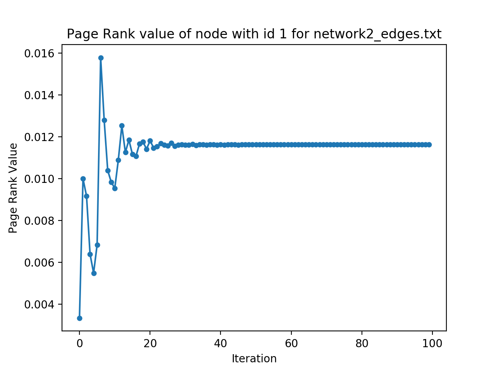

# Homework 1

The objective of the programming assignment is to give you a better understanding of page rank. We have provided you two graphs with 100 nodes each. You can find the list of the node ids and their categories in the file nodes.txt. The edges for the graphs can be found in the files network1 edges.txt and network2 edges.txt respectively.

Apply the page rank algorithm on the graphs separately for 100 iterations. You are free to use methods from existing libraries like NetworkX (https://networkx.github.io), SNAP (https://snap.stanford.edu/snappy/), etc.

## Programming Language

Python 3.7

## Requirements

```bash
pip install networkx
pip install matplotlib
```

## Usage

### Example

`query.py`

```bash
python query.py NODE_FILE_NAME EDGE_FILE_NAME CATEGORY
```

`plot.py`

```bash
python plot.py NODE_FILE_NAME EDGE_FILE_NAME NODE_ID
```

### Usage for Programming Questions

1. For a search query on category **Sports**, list out the top-10 nodes in decreasing order of pagerank for **network1**.

```bash
python query.py nodes.txt network1_edges.txt sports
```

```txt
No.	Node	Value
1 	 22 	 0.07337147814497139
2 	 10 	 0.07336692613970157
3 	 3 	 0.05674003392784882
4 	 7 	 0.0481100988197505
5 	 2 	 0.035637325246298875
6 	 0 	 0.03134989001865639
7 	 17 	 0.012485129298648881
8 	 26 	 0.012482762945723975
9 	 16 	 0.007267142437929469
10 	 13 	 0.007266736188418042
```

2. For a search query on category **Politics**, list out the top-10 nodes in decreasing order
of pagerank for **network2**.

```bash
python query.py nodes.txt network2_edges.txt politics
```

```txt
No.	Node	Value
1 	 30 	 0.051742896164872605
2 	 59 	 0.03836912833787751
3 	 57 	 0.03038112410481666
4 	 56 	 0.02877948949505145
5 	 33 	 0.0249041637599057
6 	 49 	 0.019186021715327593
7 	 31 	 0.01748788290177016
8 	 39 	 0.014388138711190181
9 	 65 	 0.014388138711190181
10 	 60 	 0.012935762500057324
```

3. Plot a graph showing the variation in page rank value of **node with id 1** for **network1**
over 100 iterations.

```bash
python plot.py nodes.txt network1_edges.txt 1
```


4. Plot a graph showing the variation in page rank value of **node with id 1** for **network2** over 100 iterations.

```bash
python plot.py nodes.txt network2_edges.txt 1
```

