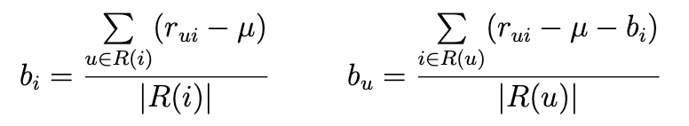
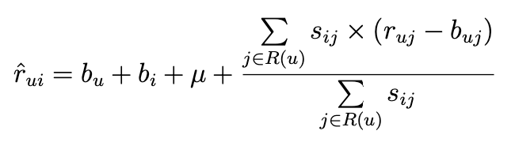
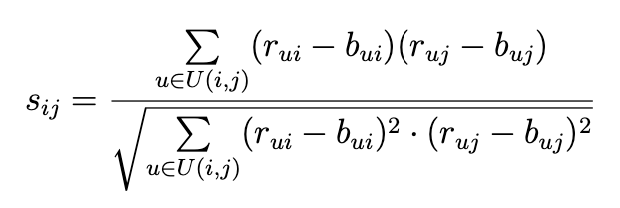
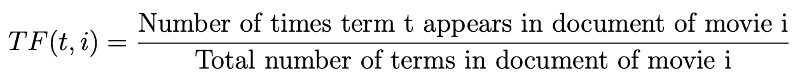
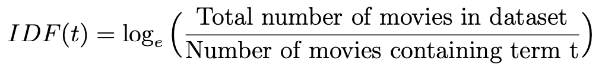
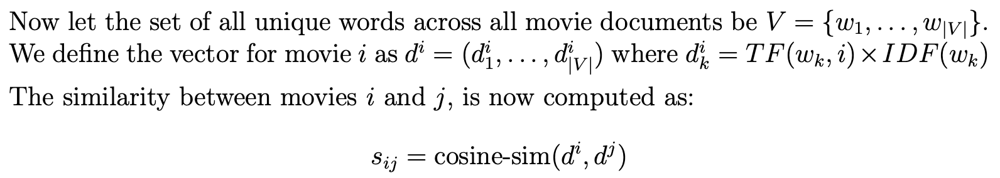

# Homework 4: Design Movie Recommender System

The objective of this assignment is to design a movie recommender system, i.e., recommend movies to users using item-item neighborhood models. The dataset includes ratings provided by users to some movies, and movie metadata that includes title, overview, etc.

Let the set of users be represented by U = {u ∈ U} and set of movies by represented by I = {i ∈ I}. First, estimate movie biases {bi : i ∈ I} by averaging over users that rated the movie, and then estimate user biases by averaging residuals over movies rated by the user.



where μ is the global mean calculated across all the ratings available in the dataset. The rating for user u and movie i is predicted as:



where sij denotes the similarity between movies i and j. Note that the neighborhood R(u) is computed over all items rated by user u. In this assignment, we explore two approaches to compute movie-movie similarities.

1. Pearson correlation: Estimate movie-movie similarity using empirical Pearson cor- relation coefficient on shared support of items i and j, defined as:



where U(i,j) is the set of users who have rated movies i and j, and bui = bu + bi + μ

2. Content similarity:

Movie metadata is a collection of words, sij is the cosine similarity between the two movie documents i and j. In order to calculate cosine similarity, we first convert the documents to a vectors using TF-IDF.

**Term Frequency** also known as TF, measures the number of times a term (word) occurs in a document, normalized by document length.



**Inverse Document** Frequency also known as IDF, measures how important a term is to a particular movie.





In this MP, given an input (u,i) , you need to output the estimated rating value rˆ . ui
Round rˆ to 1 decimal point.

## Input format

The input contains the (user,movie) ratings, movie metadata and the (user,movie) pairs for which you need to estimate the ratings.

The first line of the input contains two space separated integers R M. R is the number of lines of user-movie ratings and M is the number of movies. Next R lines contain the ratings. Each line contains three space-separated values (user-id, movie-id, rating). Next M lines contain the metadata. The first entry in each line is the movie id, followed by words describing movie metadata. The last five lines contain two space-separated integers (target user-id, target movie-id) for which you need to estimate the ratings.

## Programming Language

Python 3.7

## Requirements

```bash
pip3 install numpy
```

## Usage

```bash
python3 recommender.py INPUT_FILE_NAME OUTPUT_FILE_NAME
```

### Example

```bash
python3 recommender.py input_b.txt output.txt
```
